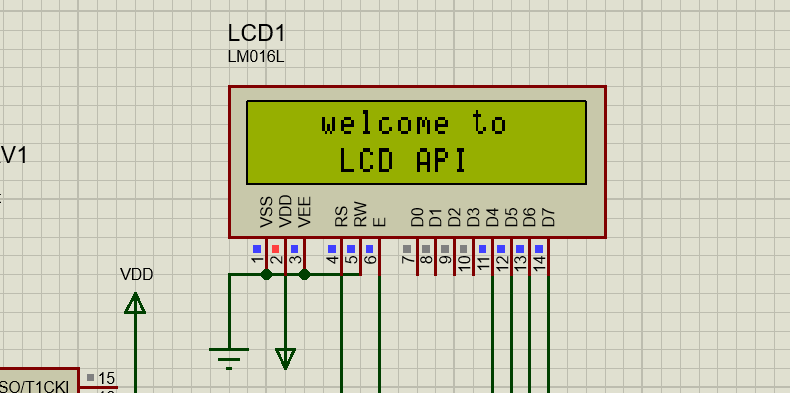
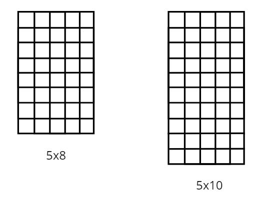

### LCD API

#### C interface to connect PIC in 16x2 LCD displays, based on HD44780.



### Headers
- stdint.h
- stdbool.h
- stdlib.h
- stdarg.h

### Configuration constants
  - Interface comunication mode 
    - SET_8BIT_INTERFACE
    ```
    Use D0 to D7 pins to data transfer.
    ```
    - SET_4BIT_INTERFACE
    ```
    Use D4 to D7 pins to data transfer.
    ``` 
  - Display lines
    - SET_2LINE_MODE
    - SET_1LINE_MODE
  - Character size
    - SET_CHAR_5x10
    - SET_CHAR_5x8


### Functions
- send_nibble

    ```C
    void send_nibble(uint8_t data)
    ```
    ##### Sends the last 4 most important bits of a byte. (0000 `0000`)
- send_byte

    ```C
    void send_byte(uint8_t data, bool instruction_mode)
    ```
    ##### Sends one byte of data according to the communication interface.
    ```C
    instruction mode == 0  Send a character
    instruction mode == 1  Send a instruction
    ```
- lcd_clear

    ```C
    void lcd_clear()
    ```
    ##### Display clear
- lcd_move_cursor

    ```C
    void lcd_move_cursor(bool line, uint8_t column)
    ```
    ##### Moves the cursor to specified line and column.
- lcd_print

    ```C
    void lcd_print(const char* string, ...)
    ```
    ##### Print formated string like _printf_ does.

- lcd_create_char

    ```C
    bool lcd_create_char(char* character_pattern, uint8_t memory_position uint8_t dot_pattern)
    ```
    ##### Sends personalized character to CGRAM
    ```
    character_patter: 8 or 10 elements array
    memory_postition: 0 to 7 memory position 
    dot_pattern:       Use SET_CHAR_5x10 or SET_CHAR_5x8
    ```

- lcd_print_cg
  ```C
  void lcd_print_cg(uint8_t memory_position)
  ```
  ##### Print a personalized character once created. Memory position refers to array index of CGRAM.

- lcd_init

    ```C
    void lcd_init(uint8_t lines, uint8_t char_size)
    ```
    ##### Initialize display by function.
    ```C
    lines:     Use SET_1LINE_MODE or SET_2LINE_MODE
    char_size: Use SET_CHAR_5x10 or SET_CHAR_5x8
    ```

### Notes

#### OBS: Interface mode constant must be defined BEFORE header include.

```C
#define LCD_4BIT_INTERFACE
#include "lcd_api.h."
```

#### If the xc8 compiller is installed in custom folder, you must to initialize COMPILER_PATH constant

```C
#define COMPILER_PATH "absolute_path/xc.h"
```

### Example

```C
#define LCD_4BIT_INTERFACE
#include "lcd_api.h."

int main(){

    lcd_init(2,SET_CHAR_5x8);

    while(1){
        lcd_print("hello");
        DELAY_MS(500);
        lcd_clear();
    }

    return 0;
}
```
